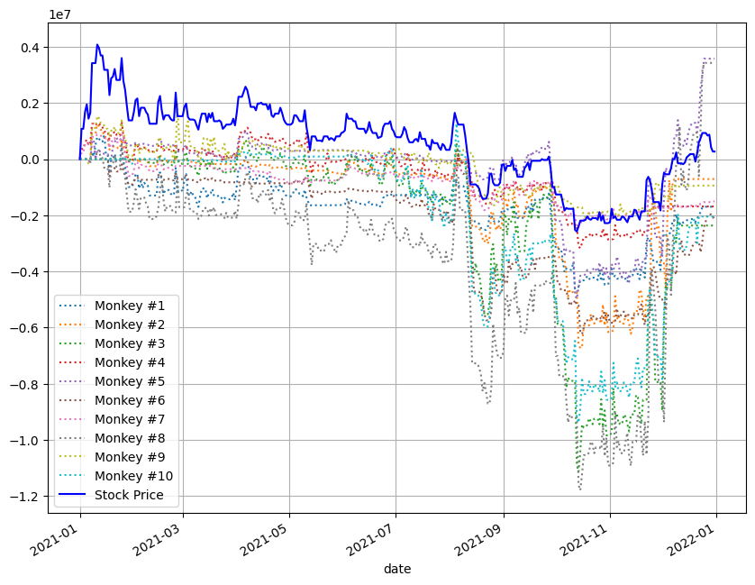
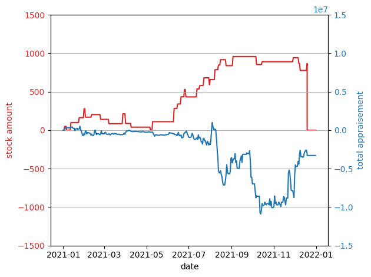

# stock-project

주식 관련 코드 모음입니다.

## 설치 방법

git을 설치하고 원하는 폴더에 터미널을 연 뒤 `git clone https://github.com/ilotoki0804/stock-project.git`를 치세요.

필요하다면 venv를 설정하고 필요한 패키지를 다운로드받습니다.

> [!WARNING]
> 설치 전 가상 환경이 잘 설치되었는지, 터미널이 가리키고 있는 방향이 루트 디렉토리(LICENSE나 README.md가 있는 폴더)가 맞는지, 파이썬 버전이 3.10 이상인지 확인하세요.

```console
pip install -r requirements.txt
```

### 업데이트

루트 디렉토리에서 터미널을 열고 `git fetch`를 입력해 주세요.

아무런 메시지도 뜨지 않는다면 이미 최신 상태였다는 의미이고 무언가가 나타난다면 업데이트되었다는 의미입니다.

### keys.json

KEY 상수를 사용하려면 루트 디렉토리에 `keys.json`이 있어야 합니다.

우리 팀의 `keys.json`은 디스코드에 업로드되어 있으니 사용하시면 됩니다.

`keys.json`은 다음과 같은 형식으로 되어 있습니다.

```json
{
    "api_key": "...",
    "api_secret": "...",
    "acc_no": "..."
}
```

설명은 아래의 '사용법'을 참고하세요.

## 사용법

### KEY 사용하기

KEY를 이용하려면 우선 `keys.json`을 폴더에 넣어야 합니다. 자세한 방법은 '설치 방법'을 참고하세요.

`keys.json`이 설치되었다면 다음과 같이 간편하게 mojito를 사용할 수 있습니다.

```python
from stocks import adjust_price_unit, KEY
import mojito

broker = mojito.KoreaInvestment(**KEY)
...
```

### adjust_price_unit 사용하기

`adjust_price_unit`은 지정가 매수 시 호가 단위를 맞출 수 있도록 합니다. 자세한 설명은 `adjust_price_unit`의 docs와 해당 함수가 선언된 모듈의 docs를 참고하세요.

### 매수, 매도 등 사용 및 예제 확인하기

Repo 내 examples.py에는 어떻게 adjust_price_unit를 사용하는지와 매수, 매도를 어떻게 하는 지에 대한 예제가 있습니다. 해당 내용을 참고하세요.

### 가격 불러오기

가격을 불러오는 방식은 세 가지가 있습니다.

1. transaction_and_state.PriceCache: 하루의 데이터를 알고 싶은 경우 사용
1. data_management.fetch_prices_by_datetime: 기간의 데이터를 알고 싶은 경우 사용
1. data_management._fetch_prices_unsafe: 위와 동일하고 더 빠르지만 100일 이상의 데이터를 불러올 수 없음.

일반적으로 3번을 사용할 일은 적을 것이고 PriceCache나 fetch_prices_by_datetime을 사용하게 될 가능성이 높습니다.

PriceCache과 fetch_prices_by_datetime의 차이점은 기간으로 불러올 수 있는지와 아닌지의 차이도 있지만 결정적인 것은 바로 캐싱의 여부입니다.
캐싱이란 데이터를 서버에서 불러온 후 만약 이미 전에 불러온 데이터라면 서버를 경유하지 않고 미리 가지고 있던 데이터에서 가져오는 것을 의미합니다.
fetch_prices_by_datetime는 캐싱이 되지 않지만 PriceCache는 캐싱이 됩니다.

캐싱을 사용한다면 같은 데이터를 여러 번 사용하는 경우 속도를 높일 수 있기 때문에 특별한 경우를 제외하면 fetch_prices_by_datetime 대신 PriceCache를 사용하는 것을 권장합니다.

#### fetch_prices_by_datetime 사용하기

fetch_prices_by_datetime은 다음과 같이 사용할 수 있습니다.

```python
from datetime import datetime
import mojito
from stocks import KEY
from stocks.data_management import _fetch_prices_unsafe, fetch_prices_by_datetime

broker = mojito.KoreaInvestment(**KEY)

fetch_prices_by_datetime(
    broker=broker,
    company_code="005930",  # 종목 코드
    date_type='D',  # 일봉 사용 ('D', 'M', 'Y' 사용 가능)
    start_day=datetime(2019, 5, 7),  # 2019년 5월 7일부터
    end_day=datetime(2023, 2, 15),  # 2023년 2월 14일까지 (2월 15일 데이터는 포함되지 않음!!!)
)
```

여기에서 주의해야 할 점은 파이썬의 `range()`나 slicing처럼 end_day에 그 당일은 포함되지 않는다는 점입니다.
mojito 모듈과 이 부분에서 다르니 주의하세요.

### PriceCache 사용하기

PriceCache모듈은 다음과 같이 사용이 가능합니다.

```python
from datetime import datetime

from stocks import PriceCache

price_cache = PriceCache.from_keys_json(
    default_company_code='005930', # 기본 종목 코드가 설정되었기 때문에 get_price에서 company_code를 생략할 수도 있음.
    alert_different_day=True,
)

# 혹은 brocker를 직접 넘겨줄 수도 있음.
broker = mojito.KoreaInvestment(**KEY)
price_cache = PriceCache(
    broker=broker,
    default_company_code=None,  # None이기 때문에 get_price에서는 항상 company_code를 정의해야 함.
    alert_different_day=False,  # 만약 기본 날짜와 다른 날짜가 나온다면 경고를 할 것인지 결정함. 나중에 삭제될 수 있음.
)

price_cache.get_price(
    # 값을 가져올 날짜
    day=datetime(2020, 1, 4),

    # 이 값은 만약 생략됐다면 default_company_code에 넘겨준 값을 사용하고, 만약 넘겨진 값이 없다면 오류가 남.
    company_code="005930",

    # 얼마나 가까운 날짜까지 사용할지 정함. None일 경우 100일로 설정됨.
    nearest_day_threshold=None,

    # 가져올 때 어느 방향으로 가져올지 정함. ('past': 과거의 데이터만, 'future' 미래의 데이터만, 'both': 양쪽 중 가까운 쪽)
    date_direction="past",
)
```

### 불러오는 데이터

불러오는 데이터는 다음과 같습니다.

```json
{
    "stck_bsop_date": "20200103",
    "stck_clpr": "55500",
    "stck_oprc": "56000",
    "stck_hgpr": "56600",
    "stck_lwpr": "54900",
    "acml_vol": "15422255",
    "acml_tr_pbmn": "860206709400",
    "flng_cls_code": "00",
    "prtt_rate": "0.00",
    "mod_yn": "N",
    "prdy_vrss_sign": "2",
    "prdy_vrss": "300",
    "revl_issu_reas": ""
}
```

이 데이터는 api 원본 그대로로 각각의 의미는 다음과 같습니다. ([출처](https://apiportal.koreainvestment.com/apiservice/apiservice-domestic-stock-quotations#L_3cd9430c-e80e-4671-89a9-bd873dd047ae))

* stck_bsop_date: 날짜
* stck_clpr: 종가
* stck_oprc: 시가
* stck_hgpr: 고가
* stck_lwpr: 저가
* acml_vol: 누적 거래량
* acml_tr_pbmn: 누적 거래 대금
* prtt_rate: 분할 비율 (아마 액면분할 시 그 비율을 의미하는 것으로 보임)
* mod_yn: 분할변경여부 (액면분할 여부로 추정됨)
* prdy_vrss_sign: 전일 대비 부호 (1: 상한, 2: 상승, 3: 보합, 4: 하한, 5: 하락)
* prdy_vrss: 전일 대비
* revl_issu_reas: 재평가사유코드

모든 값을 일차적으로 string을 반환한다는 점을 잊지 마세요.

### Transaction Dataclass

Transaction은 한 독립적인 거래를 상징합니다.

#### Transaction의 상태

Transaction의 상태에는 다음과 같은 것들이 있습니다.

* date: 해당 거래가 이루어진 날짜입니다.
* company_code: 해당 회사의 종목 코드입니다.
* amount: 얼마나 사거나 팔았는지를 의미합니다.
    양수라면 매수를 의미하고 음수라면 매도를 의미합니다.
* sell_price: 얼마의 가격에 사거나 팔았는지를 설정합니다.

    이 값은 시가/종가/고가/저가로 정의할 수 있습니다.

    각각 시가는 'open'이고, 종가는 'close', 고가는 'high', 저가는 'low'입니다.

    혹은 직접 정수의 값으로 설정할 수 있습니다. 이때 이 가격은 고가 이하 저가 이상이어야 합니다.

#### Transaction 예시

예를 들어 다음과 같이 Transaction을 정의할 수 있습니다.

```python
from stocks.transaction_and_state import Transaction
from datetime import datetime

Transaction(
    datetime(2022, 11, 10),  # 2022년 11월 10일에
    '005930',  # 삼성전자를
    3,  # 3개 매수한다.
    'close',  # 일봉의 종가로
)
Transaction(
    datetime(2023, 10, 7),  # 2021년 1월 30일에
    '035720',  # 카카오를
    -24,  # 24개 매도한다.
    43060, # 43060원으로
)
```

### State Dataclass

해당 날짜나 거래 후의 상태를 나타내는 dataclass입니다.

#### State의 상태

State의 상태들은 다음과 같습니다.

* date: 해당하는 날짜입니다.
* total_appraisement: 총 평가액으로, 주식 평가액과 예산을 합친 금액입니다.
* budget: 예산으로, 현재 수중에 돈이 얼마나 있는지를 나타낸 금액입니다.
    이 값을 0으로 놓으면 total_appraisement가 음수일 경우 손실, 양수일 경우 이익이 되어 계산하기에 직관적입니다.
* stocks: 주식들입니다. type은 `dict[str, tuple[int, int]]`로 `dict[종목 코드, tuple[주수, 현재가]]`입니다.
    주수는 음수가 될 수도 있습니다.
* privous_state: 이전 State입니다. None일 수도 있습니다.
* transaction: 해당 State의 stocks가 변경되는 데에 어떤 transaction이 기여했을 때 해당 transaction의 값입니다.

#### State 예시

* 실제로 State를 직접 정의해야 하는 상황은 드뭅니다. State가 무엇인지만 알면 충분합니다.

`State.from_previous_state`을 이용해 정의하는 방법은 다음과 같습니다.

```python
from stocks import KEY
from stocks.transaction_and_state import State, Transaction, PriceCache
from datetime import datetime

price_cache = PriceCache.from_keys_json(**KEY)

State.from_previous_state(
    price_cache,
    datetime(2022, 6, 12),  # 2022년 6월 12일
    None,  # 이전 상태 없음
    Transaction(datetime(2023, 7, 15), '035720', -20, 'close'),  # 이러한 Transaction을 사용함.
)
```

### emulate_trade 사용하기

`emulate_trade`는 주식 매매 기록을 받으면 예산이나 주식 평가액 등을 계산해서 답을 내는 함수입니다.

#### 사전 준비

price_cache 인스턴스와 transactions(거래 내역)을 준비합니다.

```python
from datetime import datetime

import pandas as pd

from stocks import KEY, PriceCache, emulate_trade
from stocks.transaction_and_state import Transaction, State

# 하기 전에 keys.json이 있는지 꼭 확인하세요!!
price_cache = PriceCache.from_keys_json()

# 자신이 원하는 거래 내역을 여기에 설정해주세요.
transactions = [
    Transaction(datetime(2022, 6, 10), '086520', 10, 'open'),
    Transaction(datetime(2022, 11, 10), '005930', 3, 'open'),
    Transaction(datetime(2023, 5, 23), '086520', -10, 'close'),
    Transaction(datetime(2023, 5, 23), '035720', 20, 'close'),
    Transaction(datetime(2023, 5, 23), '005930', 4, 'close'),
    Transaction(datetime(2023, 5, 30), '005930', -7, 'close'),
    Transaction(datetime(2023, 7, 15), '035720', -20, 'close'),
]
```

#### 결과 가져오기

price_cache와 transactions를 emulate_trade에 넘깁니다.

주의할 점은 emulate_trade의 결과값은 dataframe이 아닌 `list[State]`이기 때문에 dataframe으로 변경하려면 `pd.DataFrame()`을 통과시켜야 합니다. (추후에 에초에 Dataframe을 return하는 것으로 변경될 가능성이 있습니다.)

```python
result = pd.DataFrame(emulate_trade(price_cache, transactions, initial_state))
# print로 값을 확인하는 것 대신 jupyter notebook을 사용하는 것을 권장합니다.
# 여기에서는 텍스트로 보여주기 위해 print를 사용합니다.
print(result)
#           date  total_appraisement   budget                   stocks  \
# 0   2022-06-09              100000  1000000                       {}   
# 1   2022-06-10             1000000   249170  {'086520': (10, 75083)}   
# 2   2022-06-11              994170   249170  {'086520': (10, 74500)}   
...
# 401                                               None  
# 402                                               None  
# 403  {'date': 2023-07-15 00:00:00, 'company_code': ...  

# [404 rows x 6 columns]
```

`only_if_transaction_exists`가 True일 경우 transaction이 있었던 날의 State만을 불러옵니다.

```python
result = pd.DataFrame(emulate_trade(price_cache, transactions, initial_state, only_if_transaction_exists=True))
# print로 값을 확인하는 것 대신 jupyter notebook을 사용하는 것을 권장합니다.
# 여기에서는 텍스트로 보여주기 위해 print를 사용합니다.
print(result)
#         date  total_appraisement   budget  \
# 0 2022-06-09              100000  1000000   
# 1 2022-06-10             1000000   249170   
# 2 2022-11-10             1509950    64970   
...
# 5  {'date': 2023-05-23 00:00:00, 'company_code': ...  
# 6  {'date': 2023-05-30 00:00:00, 'company_code': ...  
# 7  {'date': 2023-07-15 00:00:00, 'company_code': ...  
```

### 원숭이 투자자

원숭이 투자자란 무작위로 주식을 사거나 파는 모의 투자자를 의미합니다.

원숭이 투자자를 통해 자신의 알고리즘이 효율적인지 테스트해볼 수 있습니다.

사용법은 다음과 같습니다.

```python
args = monkey_investor(
    price_cache=price_cache,
    company_code='005930',  # 투자할 회사의 종목 코드
    start_day=datetime(2021, 1, 1),  # 투자 시작일
    end_day=datetime(2021, 12, 31),  # 투자 종료일 (이 값을 포함함)
    invest_amount=(100, 30),  # 투자량, 자료: (평균, 표준편차)
    total_invest_count=36,  # 총 투자수
    seed=10,  # 랜덤값의 시드. None일 경우 별도로 정하지 않음.
)

`fetch_prices_by_datetime`와는 다르게 투자 종료일을 포함합니다. 주의해 주세요.

이 함수는 emulate_trade를 실행하지는 않으며, emulate_trade에 바로 사용할 수 있는 인자를 내보냅니다.

이를 unpacking으로 emulate_trade에 넣어 실행할 수 있습니다.

```python
args = monkey_investor(
    price_cache,
    '005930',
    datetime(2021, 1, 1),
    datetime(2021, 12, 31),
    (100, 30),
    36,
    1,
)
result = pd.DataFrame(emulate_trade(*args))
```

#### 응용

여러 원숭이 투자자들을 생성한 뒤 주식 자체의 값과 비교하는 코드는 다음과 같이 작성이 가능합니다.

```python
# 원숭이 투자자를 10개 생성
args_list = (monkey_investor(
    price_cache,
    '005930',
    datetime(2021, 1, 1),
    datetime(2021, 12, 31),
    (100, 30),
    36,
    1000 + i,
) for i in range(10))
results = [pd.DataFrame(emulate_trade(*args)) for args in args_list]

# 주식의 가격 변동을 확인함.
initial_state = State.from_previous_state(price_cache, datetime(2021, 1, 1), None, None)
transactions = [Transaction(datetime(2021, 1, 1), company_code='005930', amount=300, sell_price='open')]

stock_itself = pd.DataFrame(emulate_trade(price_cache, transactions, initial_state, datetime(2021, 12, 31)))

# 플롯 생성
total_appraisements = [result['total_appraisement'] for result in results]

df = pd.DataFrame()
for i, total_appraisement in enumerate(total_appraisements, 1):
    df[f'Monkey #{i}'] = total_appraisement
df['Stock Price'] = stock_itself['total_appraisement']

df = df.set_index(stock_itself['date'])

df.plot(figsize=(10, 8), grid=True, style=[':'] * 10 + ['b-'])
```

생성된 그래프는 다음과 같습니다.


### 다양한 데이터로 플롯 그리기

한 원숭이 투자자에 대한 주식 보유수와 주식 평가액으로 그린 플롯은 다음과 같습니다.

```python
from datetime import datetime

import pandas as pd
import matplotlib.pyplot as plt

from stocks import emulate_trade, PriceCache
from stocks.monkey_investor import monkey_investor

price_cache = PriceCache.from_keys_json()

args = monkey_investor(
    price_cache,
    '005930',
    datetime(2021, 1, 1),
    datetime(2021, 12, 31),
    (100, 30),
    36,
    1234,
)
result = pd.DataFrame(emulate_trade(*args))

fig, ax1 = plt.subplots()

color = 'tab:red'
ax1.set_xlabel('date')
ax1.set_ylabel('stock amount', color='tab:red')
ax1.plot(result['date'], [stock.get('005930', (0, 0))[0] for stock in result['stocks']], color=color)
ax1.set_ylim(-1500, 1500)
ax1.tick_params(axis='y', labelcolor=color)

ax2 = ax1.twinx()

color = 'tab:blue'
ax2.set_ylabel('total appraisement', color='tab:blue')
ax2.plot(result['date'],
         [total_appraisement for total_appraisement in result['total_appraisement']], color=color)
ax2.set_ylim(-15_000_000, 15_000_000)
ax2.tick_params(axis='y', labelcolor=color)

fig.tight_layout()
plt.grid(True)
plt.show()
```

생성된 그래프는 다음과 같습니다.


